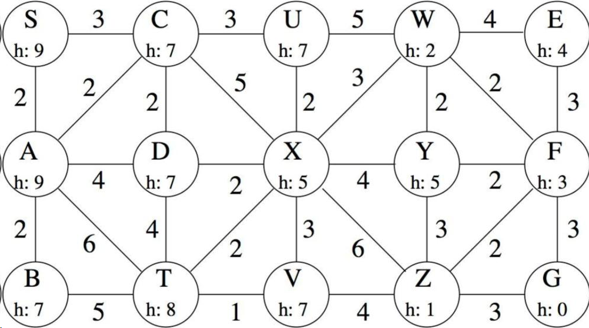
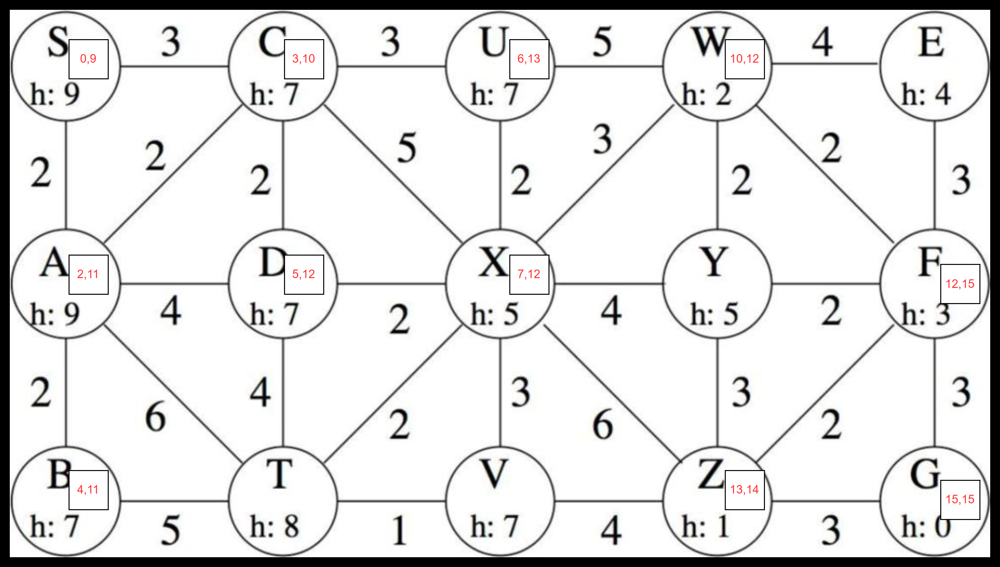
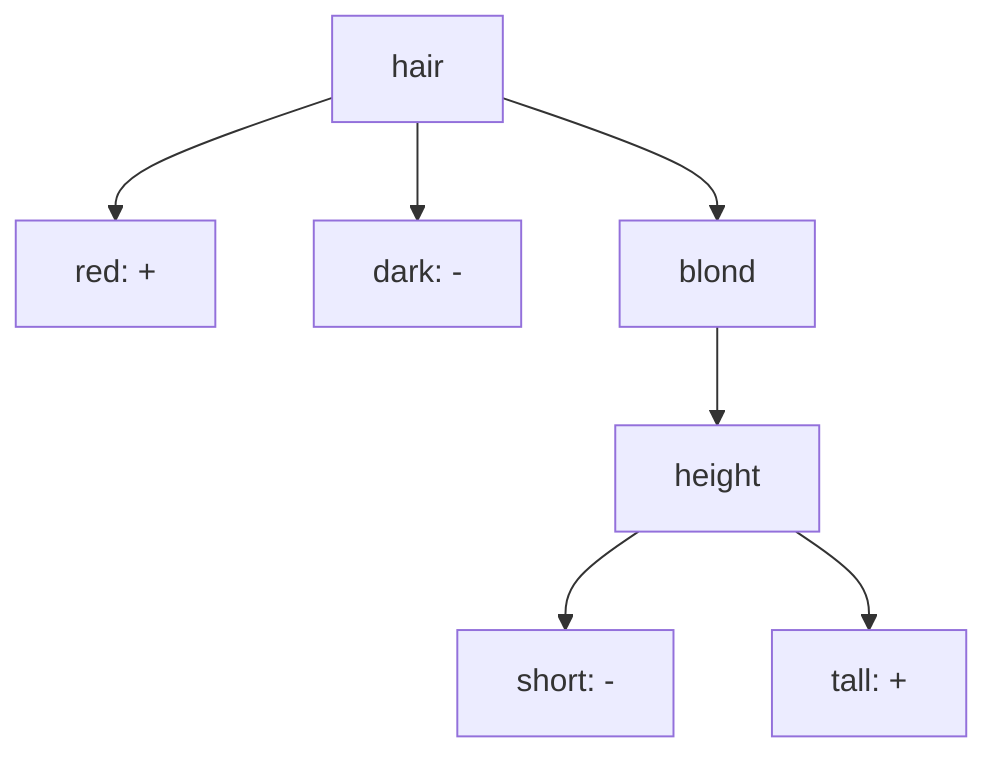
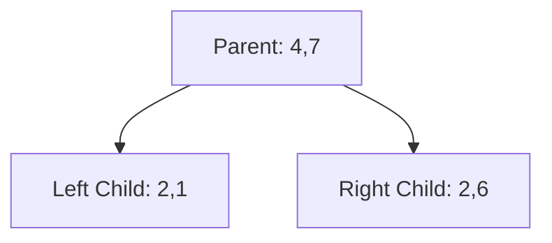
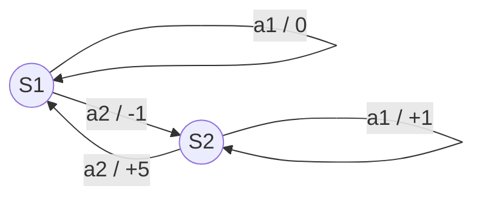

# Exercise Collections
## Search Algorithms
Start from S and end at G. Follow the alphabetical order when there is a choice.

BFS Path: S -> A -> C -> B -> D -> T -> U -> X -> V -> W -> Y -> Z -> E -> F -> G

DFS Path: S -> A -> B -> T -> V -> X -> U -> W -> E -> F -> G

UCS Path: S(0) -> A(2) -> C(3) -> B(4) -> D(5) -> U(6) -> X(7) -> T(8) -> V(9) -> W(10) -> Y(11) -> F(12) -> Z(13) -> E(14) -> G(15)

Greedy Best-First Search Path: S -> C -> X -> Z -> G

A* Search Path: S(9) -> C(10) -> A(11) -> B(11) -> D(12) -> X(12) -> W(12) -> U(13) -> Z(14) -> F(15) -> G(15)

## Machine Learning

Consider the task of predicting whether children are likely to be hired to play members of the Von Trapp Family in a production of *The Sound of Music*, based on the data in Table:

### Table: Training Data

| height | hair  | eyes  | hired |
| ------ | ----- | ----- | ----- |
| short  | blond | blue  | +     |
| tall   | red   | blue  | +     |
| tall   | blond | blue  | +     |
| tall   | blond | brown | -     |
| short  | dark  | blue  | -     |
| tall   | dark  | blue  | -     |
| tall   | dark  | brown | -     |
| short  | blond | brown | -     |

---

### Questions

1. **Compute the information (entropy) gain** for each of the three attributes (**height**, **hair**, **eyes**) in terms of classifying items as belonging to the class **+** or **−**.
2. **Construct a decision tree** based on the minimum entropy principle.
3. **Use your tree to predict** whether a *short person with red hair and brown eyes* would likely be hired.

H(hired) = - (5/8) log2(5/8) - (3/8) log2(3/8) = 0.954
- For height:
  - H(hired | height=short) = - (1/3) log2(1/3) - (2/3) log2(2/3) = 0.918
  - H(hired | height=tall) = - (4/5) log2(4/5) - (1/5) log2(1/5) = 0.722
  - H(hired | height) = (3/8)*0.918 + (5/8)*0.722 = 0.793
  - Information Gain(height) = H(hired) - H(hired | height) = 0.954 - 0.793 = 0.161
- For hair:
  - H(hired | hair=blond) = - (2/4) log2(2/4) - (2/4) log2(2/4) = 1.0
  - H(hired | hair=red) = 0 (only one instance, which is +)
  - H(hired | hair=dark) = - (0/3) log2(0/3) - (3/3) log2(3/3) = 0
  - H(hired | hair) = (4/8)*1.0 + (1/8)*0 + (3/8)*0 = 0.5
  - Information Gain(hair) = H(hired) - H(hired | hair) = 0.954 - 0.5 = 0.454
- For eyes:
  - H(hired | eyes=blue) = - (3/5) log2(3/5) - (2/5) log2(2/5) = 0.971
  - H(hired | eyes=brown) = - (2/3) log2(2/3) - (1/3) log2(1/3) = 0.918
  - H(hired | eyes) = (5/8)*0.971 + (3/8)*0.918 = 0.953
  - Information Gain(eyes) = H(hired) - H(hired | eyes) = 0.954 - 0.953 = 0.001

Choosing the attribute with the highest information gain, we then choose **hair**.

For blond, we need to further split based on the remaining attributes.
Only height can split the blond group further.
We have such a decision tree:

---

### Laplace Error Pruning in Decision Trees

The Laplace error estimate for pruning a node in a Decision Tree is given by:
$$
E = 1 - \frac{n + 1}{N + K}
$$
where (N) is the total number of items, (n) is the number of items in the majority class, and (K) is the number of classes.
Given a subtree where:

* parent = [4, 7]
* left child = [2, 1]
* right child = [2, 6]

should the children be pruned or not? Show your calculations.

E_parent = 1 - (7 + 1) / (11 + 2) = 0.3846
E_left = 1 - (2 + 1) / (3 + 2) = 0.4
E_right = 1 - (6 + 1) / (8 + 2) = 0.3
E_subtree = (3/11)*0.4 + (8/11)*0.3 = 0.3273
Since E_parent (0.3846) > E_subtree (0.3273), we should not prune the children.

## ANN

### Logical Functions with Perceptrons and Neural Networks
Recall that any logical function can be converted to Conjunctive Normal Form (CNF), which means a conjunction of terms where each term is a disjunction of (possibly negated) literals.
This is an example of an expression in CNF:

$$
(A \lor B) \land (\neg B \lor C \lor \neg D) \land (D \lor \neg E)
$$

Assuming False = 0 and True = 1, explain how each of the following could be constructed.
You should include the bias for each node, as well as the values of all the weights (input-to-output or input-to-hidden and hidden-to-output, as appropriate).

* Perceptron to compute the OR function of (m) inputs,
* Perceptron to compute the AND function of (n) inputs,
* Two-layer Neural Network to compute the function
  $$
  (A \lor B) \land (\neg B \lor C \lor \neg D) \land (D \lor \neg E)
  $$

With reference to this example, explain how a two-layer neural network could be constructed to compute any (given) logical expression, assuming it is written in Conjunctive Normal Form.
**Hint:** first consider how to construct a Perceptron to compute the OR function of (m) inputs, with (k) of the (m) inputs negated.

**Perceptron for OR function of (m) inputs:**
- Weights: w_i = 1 for all inputs
- Bias: b = -0.5
- Activation function: step function (output 1 if weighted sum > 0, else 0)
- This perceptron will output 1 if at least one input is 1.

**Perceptron for AND function of (n) inputs:**
- Weights: w_i = 1 for all inputs
- Bias: b = -(n - 0.5)
- Activation function: step function (output 1 if weighted sum > 0, else 0)
- This perceptron will output 1 only if all inputs are 1.

**Two-layer Neural Network for the given CNF expression:**
1. **First Layer (OR gates for each clause):**
If some inputs are negated, assign weights accordingly (1 for positive literals, -1 for negated literals).
   - Clause 1: (A ∨ B)
      - Weights: w_A = 1, w_B = 1
      - Bias: b = -0.5
   - Clause 2: (¬B ∨ C ∨ ¬D)
      - Weights: w_¬B = -1, w_C = 1, w_¬D = -1
      - Bias: b = -0.5
   - Clause 3: (D ∨ ¬E)
      - Weights: w_D = 1, w_¬E = -1
      - Bias: b = -0.5
2. **Second Layer (AND gate to combine outputs of first layer):**
   - Weights: w_clause1 = 1, w_clause2 = 1, w_clause3 = 1
   - Bias: b = -(3 - 0.5) = -2.5
   - Activation function: step function

Therefore, the two-layer neural network can compute any logical expression in CNF by using perceptrons for OR operations in the first layer and a perceptron for AND operation in the second layer.

## Reinforcement Learning

Consider a world with two states $(S = \{S_1, S_2\})$ and two actions $(A = \{a_1, a_2\})$,
where the transitions ($\delta$) and reward ($r$) for each state and action are as follows:

\[
\begin{aligned}
\delta(S_1, a_1) &= S_1 \quad & r(S_1, a_1) &= 0 \\
\delta(S_1, a_2) &= S_2 \quad & r(S_1, a_2) &= -1 \\
\delta(S_2, a_1) &= S_2 \quad & r(S_2, a_1) &= +1 \\
\delta(S_2, a_2) &= S_1 \quad & r(S_2, a_2) &= +5
\end{aligned}
\]

---

### i.

Draw a picture of this world, using circles for the states and arrows for the transitions.

---

### ii.

Assuming a discount factor of ($\gamma = 0.9$), determine:

#### (a)

The optimal policy ($\pi^* : S \to A$)

#### (b)

The state-value function ($V^* : S \to \mathbb{R}$)

#### (c)

The action-value function ($Q^* : S \times A \to \mathbb{R}$)

---
Denote the optimal state-value function as $V^*(S_1) = v_1$ and $V^*(S_2) = v_2$.

We have the following equations:
$$
\begin{aligned}
    Q(S_1, a_1) &= r(S_1, a_1) + \gamma V^*(\delta(S_1, a_1)) = 0 + 0.9 v_1 \\
    Q(S_1, a_2) &= r(S_1, a_2) + \gamma V^*(\delta(S_1, a_2)) = -1 + 0.9 v_2 \\
    Q(S_2, a_1) &= r(S_2, a_1) + \gamma V^*(\delta(S_2, a_1)) = 1 + 0.9 v_2 \\
    Q(S_2, a_2) &= r(S_2, a_2) + \gamma V^*(\delta(S_2, a_2)) = 5 + 0.9 v_1
\end{aligned}
$$

Assume $a_2$ is the optimal action for both states, we have:
$$
\begin{aligned}
    v_1 &= Q(S_1, a_2) = -1 + 0.9 v_2 \\
    v_2 &= Q(S_2, a_2) = 5 + 0.9 v_1
\end{aligned}
$$

We solve the equations and get:
$$
\begin{aligned}
    v_1 &= \frac{350}{19}=18.421 \\
    v_2 &= \frac{410}{19}=21.579 \\
    Q^*(S_1, a_1) &= 0.9 \times \frac{350}{19} = \frac{315}{19} = 16.579 \\
    Q^*(S_1, a_2) &= -1 + 0.9 \times \frac{410}{19} = \frac{296}{19} = 15.579 \\
    Q^*(S_2, a_1) &= 1 + 0.9 \times \frac{410}{19} = \frac{379}{19} = 19.947 \\
    Q^*(S_2, a_2) &= 5 + 0.9 \times \frac{350}{19} = \frac{365}{19} = 19.211 \\
\end{aligned}
$$

$Q^*(S_1, a_2) > Q^*(S_1, a_1)$ and $Q^*(S_2, a_1) > Q^*(S_2, a_2)$, so the $a_2$ is the optimal action for both states.
Optimal Policy:
$$
\pi^*(S_1) = a_2\\
\pi^*(S_2) = a_2
$$

---

### iv.

Trace through the first few steps of the action-value function learning algorithm, 
with all Q-values initially set to zero.
Explain why it is necessary to force exploration through probabilistic choice of actions
in order to ensure convergence to the true Q-values.

Answer: If we always choose the action with the highest Q-value (greedy approach), we will 
always choose a_1 in state S1.

## Optimasisation

### Question 1: Mutations

In a genetic algorithm with 10 chromosomes, each 20 genes long, and a mutation rate of 0.01 (per gene), how many gene mutations are expected per generation?

---

$$
\begin{aligned}
\mathbb{E}(\text{mutations}) = \text{number of chromosomes} \times \text{genes per chromosome} \times \text{mutation rate} = \\10 \times 20 \times 0.01 = 2
\end{aligned}
$$

### Question 2: Offspring fitness

Suppose a genetic algorithm encodes solutions as 4-bit chromosomes, and the fitness function is

\[
f(b_1 b_2 b_3 b_4) = b_1 + 2 b_2 + 4 b_3 + 8 b_4 \quad (b_i \in {0,1})
\]

Given parent chromosomes

* (A = 1100)
* (B = 0011)

After single-point crossover between the second and third bits, what is the fitness of the offspring?

---
Children after crossover:
- Child 1: 11|11 = 1111
- Child 2: 00|00 = 0000

Fitness of Child 1:
\[
f(1111) = 1 + 2 + 4 + 8 = 15
\]
Fitness of Child 2:
\[
f(0000) = 0 + 0 + 0 + 0 = 0
\]

### Question 3: Tabu search

Given a small optimisation problem:

\[
\text{Minimise } f(x) = x^2 - 4x + 4
\]

where (x) can take integer values between −10 and 10.

Perform one iteration of the Tabu Search algorithm starting from (x = 0).

Assume two neighbours, consisting of (x = -1) and (x = 1).

What is the new value of (x) after the first iteration?

---

