# Q1


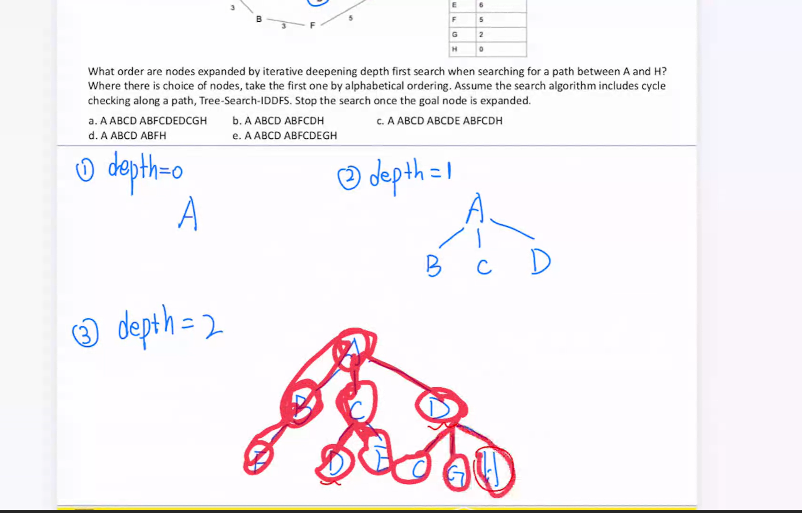


答案选A

### 解析（迭代加深深度优先搜索 IDDFS 的节点扩展顺序）

IDDFS 的核心是**逐步增加深度限制，每次限制下执行深度优先搜索（DFS）**，节点扩展遵循 “字母序优先”+“循环检测（不重复访问路径中的节点）”，目标是从 A 搜索到 H。

#### 步骤 1：确定各深度限制下的扩展过程

IDDFS 从深度限制 \(d=0\) 开始，逐步增加深度，直到找到目标 H：

##### （1）深度限制 \(d=0\)

仅扩展起点 A，无后续节点，未找到 H。

##### （2）深度限制 \(d=1\)

A 的邻接节点（字母序）：B、C、D。扩展顺序：A → B；A → C；A → D。均未到达 H，结束。

##### （3）深度限制 \(d=2\)

- 路径 A→B 的邻接节点：F（字母序），扩展 B→F。
- 路径 A→C 的邻接节点：D、E（字母序），扩展 C→D；C→E。
- 路径 A→D 的邻接节点：G、H（字母序），扩展D->C, D→G；D→H


A

ABCD

ABF CDE DCGH


# Q2  A*

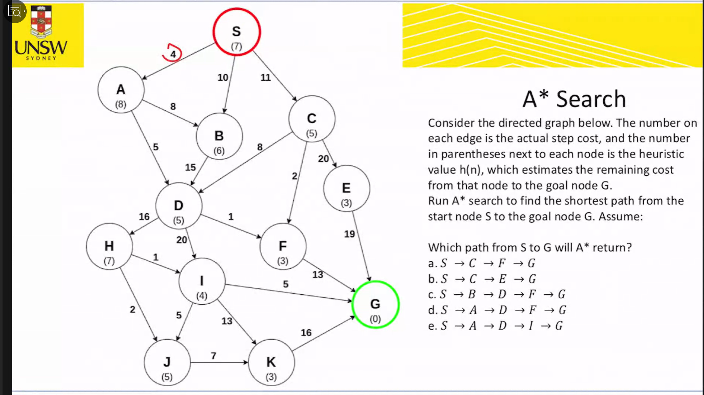

### 解析（A * 搜索的路径选择）

A * 搜索通过**估价函数 \(f(n) = g(n) + h(n)\)** 选择节点，其中：

- \(g(n)\)：从起点 S 到节点 n 的实际代价；
- \(h(n)\)：节点 n 到目标 G 的启发式估计代价；
- 优先选择 \(f(n)\) 最小的节点扩展。

#### 步骤 1：初始化起点 S

- \(f(S) = g(S) + h(S) = 0 + 7 = 7\)，开放列表（Open List）：\(\{S(f=7)\}\)。

#### 步骤 2：扩展 S 的邻接节点（A、B、C）

- **S→A**：\(g(A)=4\)，\(f(A)=4 + 8 = 12\)

- **S→B**：\(g(B)=10\)，\(f(B)=10 + 6 = 16\)

- **S→C**：\(g(C)=11\)，\(f(C)=11 + 5 = 16\)

  

  开放列表：

  \(\{A(f=12), B(f=16), C(f=16)\}\)

  ，选择

   

  f

   

  最小的 A 扩展。

#### 步骤 3：扩展 A 的邻接节点（D）

- **A→D**：\(g(D)=4+5=9\)，\(f(D)=9 + 5 = 14\)

  

  开放列表：

  \(\{D(f=14), B(f=16), C(f=16)\}\)

  ，选择

   

  f

   

  最小的 D 扩展。

#### 步骤 4：扩展 D 的邻接节点（F、I）

- **D→F**：\(g(F)=9+1=10\)，\(f(F)=10 + 3 = 13\)

- **D→I**：\(g(I)=9+20=29\)，\(f(I)=29 + 4 = 33\)

- 

  **D→H**：\(g(H)=9+16=25\)，\(f(H)=25 + 7 = 32\)

  开放列表：

  \(\{F(f=13), B(f=16), C(f=16),H(f=32) I(f=33)\}\)

  ，选择

   

  f

   

  最小的 F 扩展。

#### 步骤 5：扩展 F 的邻接节点（G）

- **F→G**：\(g(G)=10+13=23\)，\(f(G)=23 + 0 = 23\)

  

  G 是目标节点，搜索结束。

#### 最终路径

路径为：\(S → A → D → F → G\)，对应选项 **d**。

### 最终答案

选项 **d. S → A → D → F → G**。


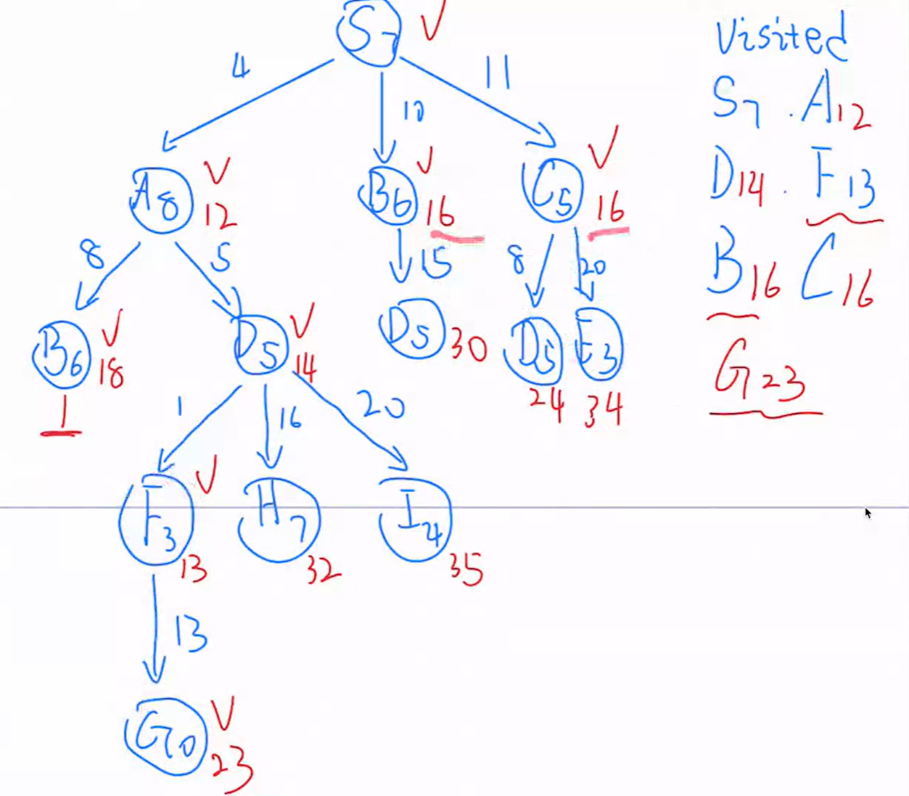


# Q3 决策树

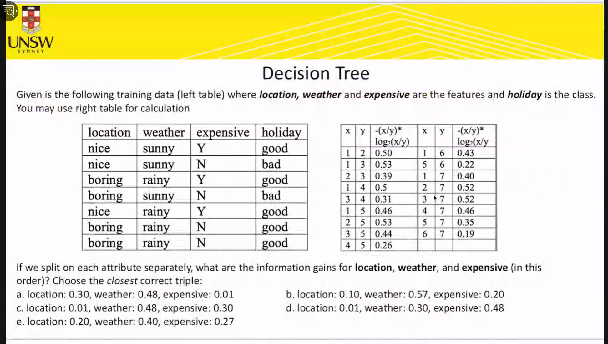

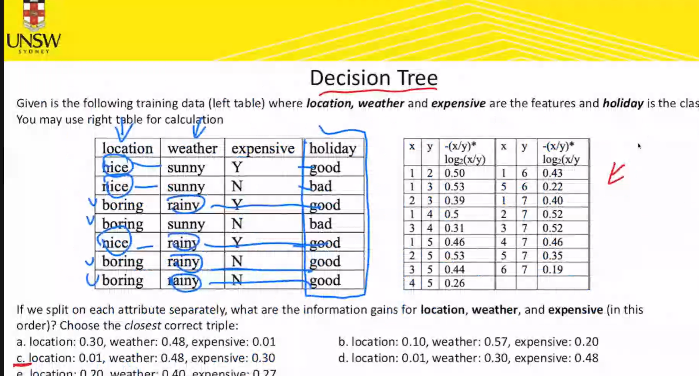

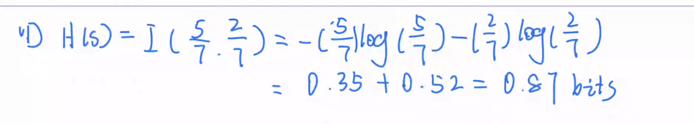


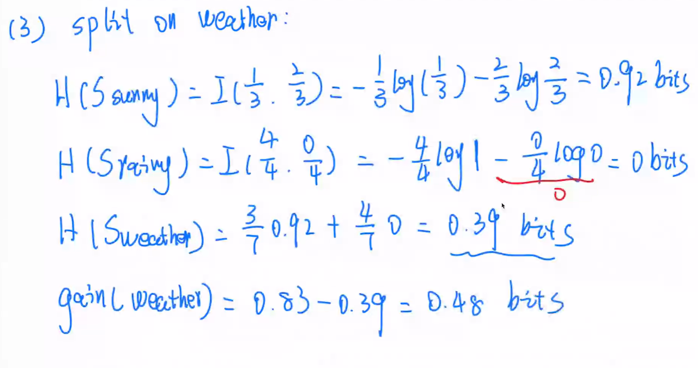

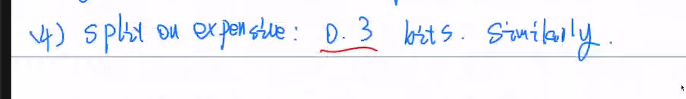

# 决策树信息增益详细计算过程

## 第一步：整理训练数据

从左表中的8个样本：

**类标签统计：**

- holiday = good: 5个
- holiday = bad: 2个
- 总共：7个样本

## 第二步：计算原始熵 H(S)

$$
H(S) = -\sum_{i} p_i \log_2(p_i)
$$

使用右表中的值：

- 当 x=2, y=5 时，$-\frac{x}{y}\log_2(\frac{x}{y}) = 0.53 $
- 当 x=5, y=7 时，$-\frac{x}{y}\log_2(\frac{x}{y}) = 0.35 $

$$
H(S) = 0.53 + 0.35 = 0.863
$$

或者用另一组：x=5, y=7 → 0.35；x=2, y=7 → 0.52
$$
H(S) = 0.35 + 0.52 = 0.863
$$

## 第三步：计算各属性的信息增益

### 3.1 Location 属性

**按 location 分割：**

- location = nice: 3个样本
  - good: 2个, bad: 1个
- location = boring: 4个样本
  - good: 3个, bad: 1个

**计算 H(location=nice)：**
$$
H(nice) = -\frac{2}{3}\log_2(\frac{2}{3}) - \frac{1}{3}\log_2(\frac{1}{3})
$$
从表中：x=1, y=3 → 0.53；x=2, y=3 → 0.39
$$
H(nice) = 0.53 + 0.39 = 0.92
$$
**计算 H(location=boring)：**
$$
H(boring) = -\frac{3}{4}\log_2(\frac{3}{4}) - \frac{1}{4}\log_2(\frac{1}{4})
$$
从表中：x=1, y=4 → 0.5；x=3, y=4 → 0.31
$$
H(boring) = 0.5 + 0.31 = 0.81
$$
**加权平均熵：**
$$
H(S|location) = \frac{3}{7} \times 0.92 + \frac{4}{7} \times 0.81
$$
**信息增益：**
$$
IG(location) = 0.863 - 0.857 = 0.006 \approx 0.01
$$

### 3.2 Weather 属性

**按 weather 分割：**

- weather = sunny: 3个样本
  - good: 1个, bad: 2个
- weather = rainy: 4个样本
  - good: 4个, bad: 0个

**计算 H(weather=sunny)：**
$$
H(sunny) = -\frac{1}{3}\log_2(\frac{1}{3}) - \frac{2}{3}\log_2(\frac{2}{3})
$$
从表中：x=1, y=3 → 0.53；x=2, y=3 → 0.39
$$
H(sunny) = 0.53 + 0.39 = 0.92
$$
**计算 H(weather=rainy)：**
$$
H(rainy) = -\frac{4}{4}\log_2(\frac{4}{4}) - \frac{0}{4}\log_2(\frac{0}{4}) = 0
$$
（纯节点，熵为0）

**加权平均熵：**
$$
H(S|weather) = \frac{3}{7} \times 0.92 + \frac{4}{7} \times 0
$$
**信息增益：**
$$
IG(weather) = 0.863 - 0.394 = 0.469 \approx 0.48
$$

### 3.3 Expensive 属性

**按 expensive 分割：**

- expensive = Y: 3个样本
  - good: 3个, bad: 0个
- expensive = N: 4个样本
  - good: 2个, bad: 2个

**计算 H(expensive=Y)：**
$$
H(Y) = -\frac{3}{3}\log_2(\frac{3}{3}) = 0
$$
（纯节点）

**计算 H(expensive=N)：**
$$
H(N) = -\frac{2}{4}\log_2(\frac{2}{4}) - \frac{2}{4}\log_2(\frac{2}{4})
$$
**加权平均熵：**
$$
H(S|expensive) = \frac{3}{7} \times 0 + \frac{4}{7} \times 1.0
$$
**信息增益：**
$$
IG(expensive) = 0.863 - 0.571 = 0.292 \approx 0.30
$$

## 第四步：结果总结

- **IG(location) ≈ 0.01**
- **IG(weather) ≈ 0.48**
- **IG(expensive) ≈ 0.30**

## 答案：选项 c

**c. location: 0.01, weather: 0.48, expensive: 0.30**


# Q4

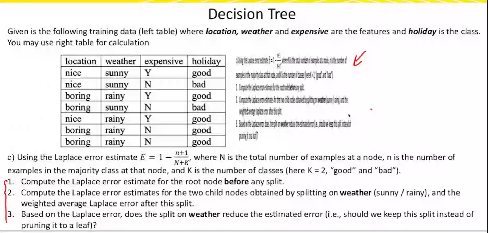

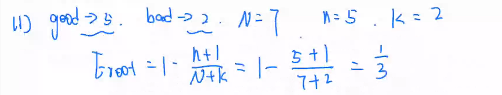


### 解析（拉普拉斯误差估计的计算）

拉普拉斯误差公式：\(E = 1 - \frac{n+1}{N+K}\)，其中：

- N：节点样本总数；
- n：节点中多数类的样本数；
- K：类别数（此处 \(K=2\)，“good” 和 “bad”）。

#### 1. 根节点的拉普拉斯误差（未分裂前）

根节点样本：\(N=7\)，多数类 “good” 的样本数 \(n=5\)。\(E_{\text{根}} = 1 - \frac{5+1}{7+2} = 1 - \frac{6}{9} \approx 0.333\)

#### 2. 按 weather 分裂后的子节点及加权平均误差

weather 的取值为 “sunny” 和 “rainy”：

- **子节点 1（sunny）**：样本数 \(N_1=3\)，多数类 “bad” 的样本数 \(n_1=2\)

  

  \(E_{\text{sunny}} = 1 - \frac{2+1}{3+2} = 1 - \frac{3}{5} = 0.4\)

- **子节点 2（rainy）**：样本数 \(N_2=4\)，多数类 “good” 的样本数 \(n_2=4\)

  

  \(E_{\text{rainy}} = 1 - \frac{4+1}{4+2} = 1 - \frac{5}{6} \approx 0.167\)

**加权平均误差**（按子节点样本数占比加权）：\(E_{\text{加权}} = \frac{N_1}{N}×E_{\text{sunny}} + \frac{N_2}{N}×E_{\text{rainy}} = \frac{3}{7}×0.4 + \frac{4}{7}×0.167 \approx 0.276\)

#### 3. 分裂是否降低误差

根节点误差（0.333）> 分裂后的加权平均误差（0.276），因此**该分裂降低了估计误差，应保留分裂**。

### 最终结果

1. 根节点误差：\(\approx 0.333\)
2. sunny 子节点误差：\(0.4\)；rainy 子节点误差：\(\approx 0.167\)；加权平均误差：\(\approx 0.276\)
3. 应保留该分裂。


# Q5


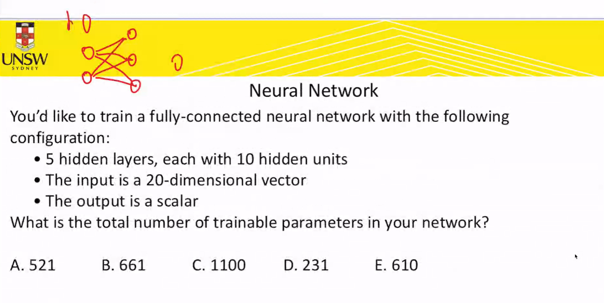

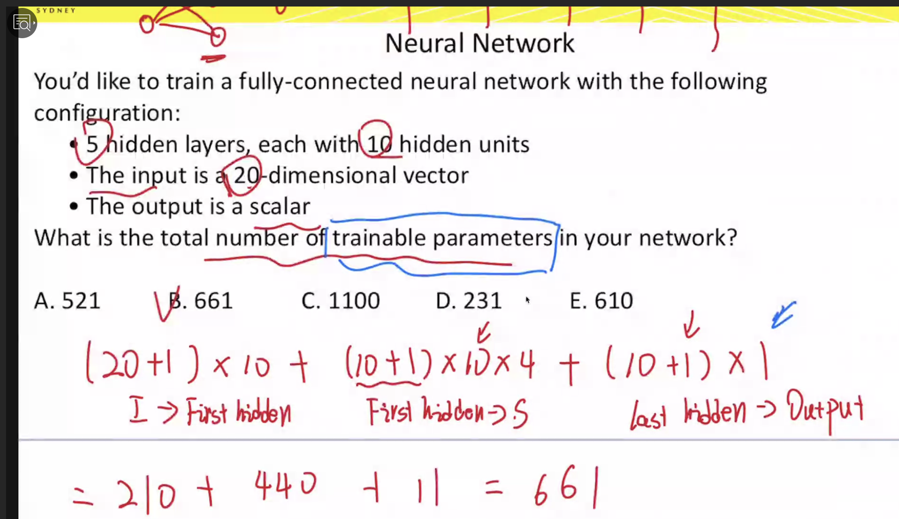

### 解析（全连接神经网络的可训练参数计算）

全连接层的可训练参数包括**权重**和**偏置**，计算公式为：

- 第i层的参数数 =（上一层神经元数 × 当前层神经元数）+ 当前层神经元数（偏置）

#### 步骤 1：确定网络结构

- 输入层：20 个神经元（20 维向量）
- 隐藏层：5 层，每层 10 个神经元
- 输出层：1 个神经元（标量）

#### 步骤 2：逐层计算参数数

1. **输入层→第 1 隐藏层**：参数数 = \(20×10 + 10 = 210\)
2. **第 1 隐藏层→第 2 隐藏层**：参数数 = \(10×10 + 10 = 110\)
3. **第 2 隐藏层→第 3 隐藏层**：参数数 = \(10×10 + 10 = 110\)
4. **第 3 隐藏层→第 4 隐藏层**：参数数 = \(10×10 + 10 = 110\)
5. **第 4 隐藏层→第 5 隐藏层**：参数数 = \(10×10 + 10 = 110\)
6. **第 5 隐藏层→输出层**：参数数 = \(10×1 + 1 = 11\)

#### 步骤 3：总参数数

总参数数 = \(210 + 110×4 + 11 = 210 + 440 + 11 = 661\)

### 最终答案

选项 **B. 661**。


# Q6

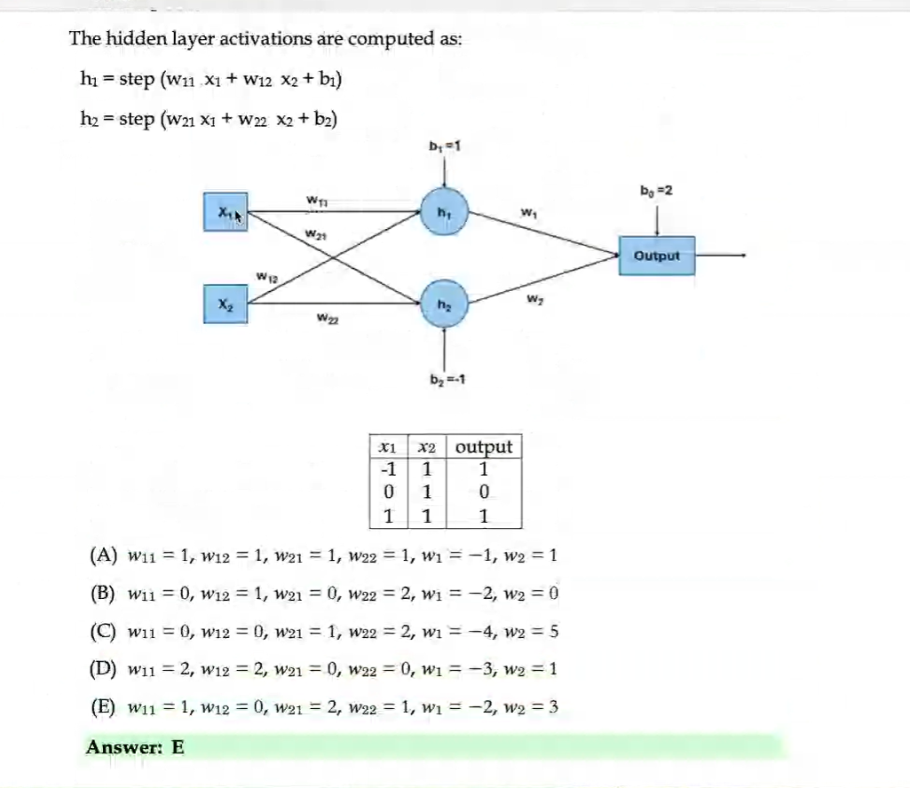


# Q7

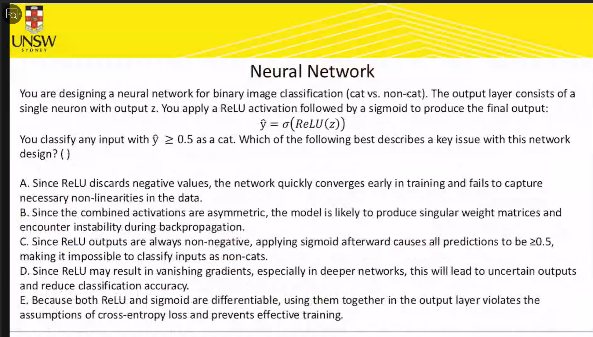

# 神经网络问题分析

## 题目翻译

你正在设计一个用于二分类图像分类（猫 vs. 非猫）的神经网络。输出层由单个神经元组成，输出为 z。你应用 ReLU 激活函数，然后使用 sigmoid 来产生最终输出：
$$
\hat{y} = \sigma(ReLU(z))
$$
你将任何
$$
\hat{y>=0.5}
$$
}的输入分类为猫。以下哪个选项最好地描述了这个网络设计的关键问题？

## 选项分析

### A. ReLU 丢弃负值，网络快速收敛但无法捕获数据中必要的非线性

**错误。** ReLU 丢弃负值是其特性，但这不是主要问题。

### B. 组合激活函数不对称，模型可能产生奇异权重矩阵并在反向传播中遇到不稳定

**错误。** 虽然组合不常见，但不会直接导致奇异矩阵问题。

### C. 由于 ReLU 输出总是非负的，之后应用 sigmoid 会导致所有预测 ≥0.5，使得无法将输入分类为非猫

**正确！** 这是关键问题。

### D. ReLU 可能导致梯度消失，特别是在深层网络中，这将导致输出不确定并降低分类准确性

**错误。** ReLU 实际上是为了**缓解**梯度消失问题而设计的。

### E. 因为 ReLU 和 sigmoid 都是可微的，在输出层一起使用它们违反了交叉熵损失的假设并阻止有效训练

**错误。**提到违反交叉熵损失（Cross-entropy loss）的假设。虽然用这个模型去训练效果会很差（因为预测值永远偏向一侧），但这并不是因为违反了数学假设，而是因为模型结构本身的设计让它无法输出负例。

## 详细解释 - 为什么选 C

### 问题分析

让我们逐步分析这个网络设计：

**步骤 1: ReLU 的输出**
$$
ReLU(z) = \max(0, z) = \begin{cases} z & \text{if } z \geq 0 \\ 0 & \text{if } z < 0 \end{cases}
$$
**关键点：ReLU 的输出范围是**
$$
[0, +\infty)
$$
**步骤 2: Sigmoid 应用于 ReLU 的输出**
$$
\hat{y} = \sigma(ReLU(z))
$$
**步骤 3: Sigmoid 函数的特性**
$$
\sigma(x) = \frac{1}{1 + e^{-x}}
$$

- 当 x = 0 时，
  $$
  \sigma(0) = 0.5
  $$
   

- 当 x > 0  时，
  $$
  \sigma(x) > 0.5
  $$
  

- 当 x < 0  时，
  $$
  \sigma(x) < 0.5
  $$
  

### 关键问题

由于 
$$
ReLU(z) \geq 0
$$
 （总是非负），所以：
$$
\hat{y} = \sigma(ReLU(z)) \geq \sigma(0) = 0.5
$$
**这意味着：**

- 所有预测值 
  $$
  \hat{y>=0.5}
  $$

- 根据分类规则
  $$
  \hat{y>=0.5  → 猫}
  $$
   **所有输入都会被分类为猫**

- **无法分类任何输入为非猫！**

### 图示说明

```
z 的值:      ... -2  -1   0   1   2 ...
            ↓   ↓   ↓   ↓   ↓   ↓
ReLU(z):        0   0   0   1   2 ...
            ↓   ↓   ↓   ↓   ↓   ↓
σ(ReLU(z)):  0.5 0.5 0.5 0.73 0.88 ...
            ↓   ↓   ↓   ↓   ↓   ↓
分类:        猫  猫  猫  猫  猫 ...
```

### 正确的设计应该是

对于二分类问题，输出层应该直接使用：
$$
\hat{y} = \sigma(z)
$$
不需要在 sigmoid 之前加 ReLU，因为：

- Sigmoid 本身就能处理正负输入
- Sigmoid 输出范围是 (0, 1) ，完美适合二分类
- z < 0 $时，\sigma(z) < 0.5  → 非猫
- z > 0 $时，\sigma(z) > 0.5  → 猫

## 答案

**C. 由于 ReLU 输出总是非负的，之后应用 sigmoid 会导致所有预测 ≥0.5，使得无法将输入分类为非猫。**

这是一个根本性的架构设计错误，会使网络完全失去分类非猫类别的能力。


# Q8


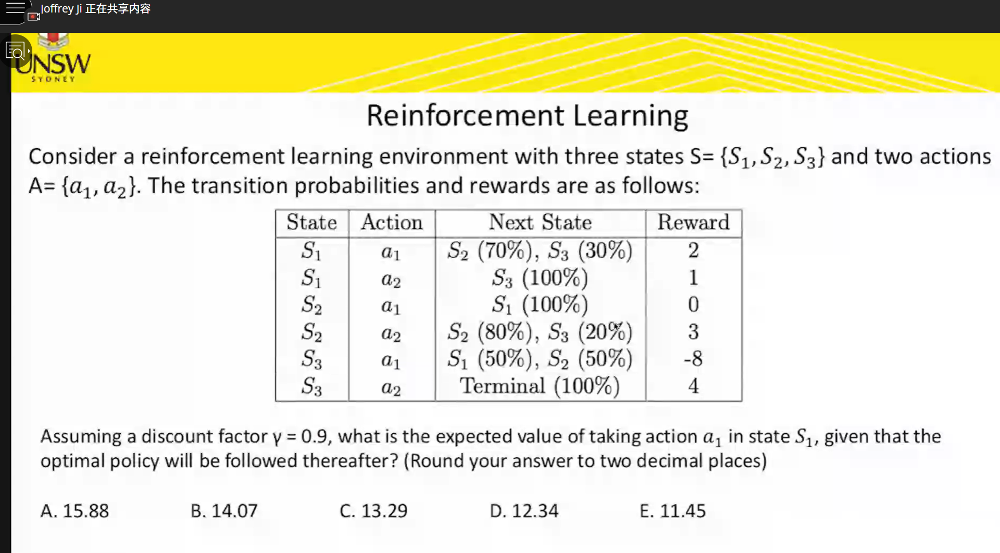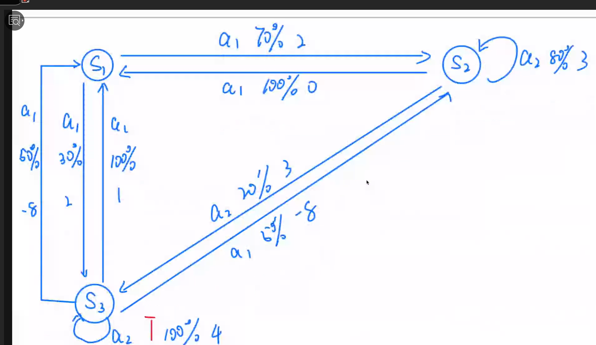


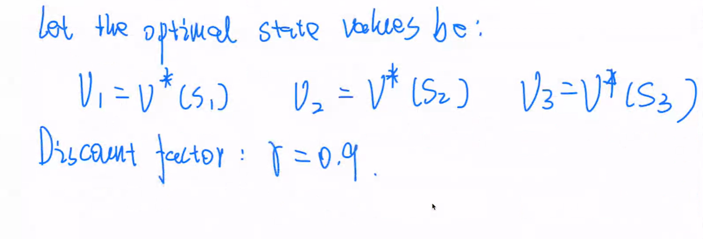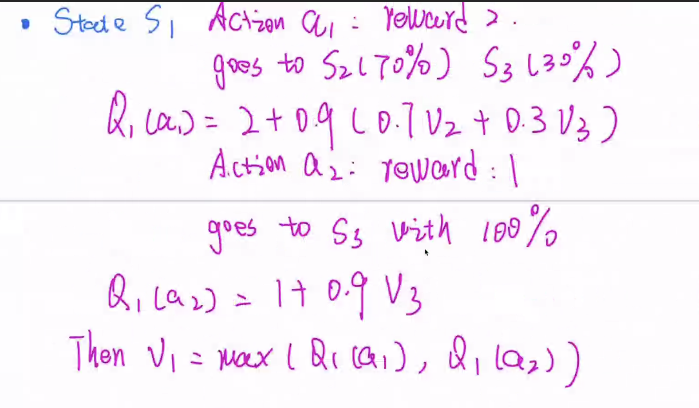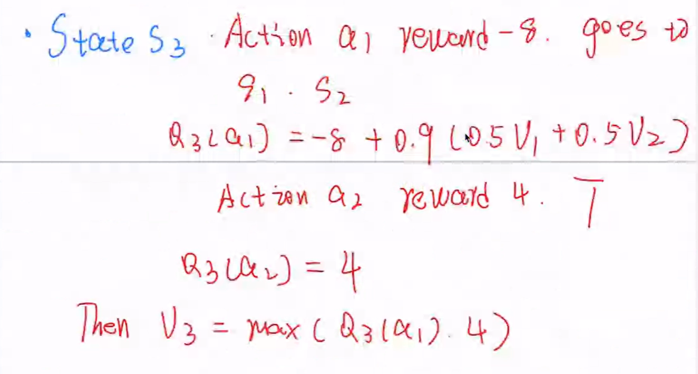


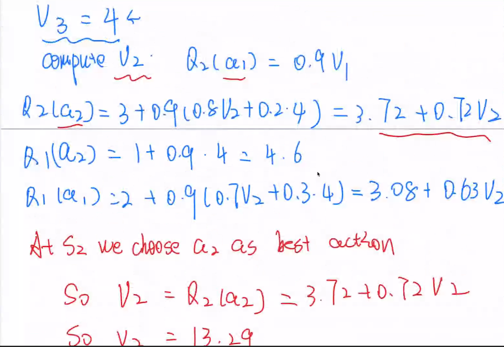


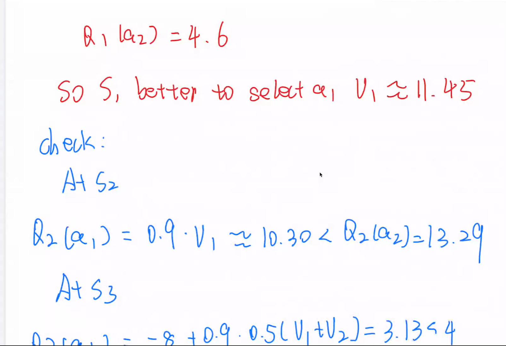


这道题考察强化学习中**Q 值（动作价值函数）\**的计算，核心是结合\**最优策略**的场景，目标是计算 \(Q(S_1, a_1)\)（状态\(S_1\)采取动作\(a_1\)后遵循最优策略的期望价值）。

### 正确答案：E. 11.45

### 一、核心公式

\(Q(s, a)\) 的计算遵循贝尔曼方程：\(Q(s, a) = R(s, a) + \gamma \sum_{s'} P(s'|s, a) V^*(s')\)其中：

- \(R(s, a)\)：当前状态 - 动作的即时奖励；
- \(\gamma = 0.9\)：折扣因子；
- \(V^*(s')\)：下一个状态的**最优价值**（该状态下采取最优动作的价值）。

### 二、步骤 1：计算 \(V^*(S_3)\)

状态\(S_3\)的两个动作：

- 动作\(a_1\)：奖励 - 8，跳回\(S_1/S_2\)（价值极低）；
- 动作\(a_2\)：奖励 4，跳到终止状态（未来价值为 0）。

显然\(a_2\)是最优动作，因此：\(V^*(S_3) = Q(S_3, a_2) = 4 + 0.9 \times 0 = 4\)

### 三、步骤 2：计算 \(V^*(S_2)\)

状态\(S_2\)的两个动作：

- 动作\(a_1\)：奖励 0，跳回\(S_1\)（价值较低）；
- 动作\(a_2\)：奖励 3，80% 留在\(S_2\)、20% 跳到\(S_3\)（正反馈循环，价值更高）。

假设\(a_2\)是最优动作，代入贝尔曼方程：\(V^*(S_2) = 3 + 0.9 \times [0.8 V^*(S_2) + 0.2 V^*(S_3)]\)

代入\(V^*(S_3)=4\)，

解方程：\(V^*(S_2) = 3 + 0.9 \times [0.8 V^*(S_2) + 0.2 \times 4]\)

\(V^*(S_2) = 3 + 0.72 V^*(S_2) + 0.72\)

\(0.28 V^*(S_2) = 3.72\)

\(V^*(S_2) = \frac{3.72}{0.28} \approx 13.2857\)

### 四、步骤 3：计算 \(Q(S_1, a_1)\)

\(S_1\)采取\(a_1\)的即时奖励\(R=2\)，转移概率：70% 到\(S_2\)、30% 到\(S_3\)。

代入公式：\(Q(S_1, a_1) = 2 + 0.9 \times [0.7 V^*(S_2) + 0.3 V^*(S_3)]\)

代入\(V^*(S_2)≈13.2857\)、\(V^*(S_3)=4\)：

\(Q(S_1, a_1) = 2 + 0.9 \times [0.7 \times 13.2857 + 0.3 \times 4]\)

\(Q(S_1, a_1) = 2 + 0.9 \times [9.3 + 1.2]\)

\(Q(S_1, a_1) = 2 + 0.9 \times 10.5 = 2 + 9.45 = 11.45\)


# Q9-C


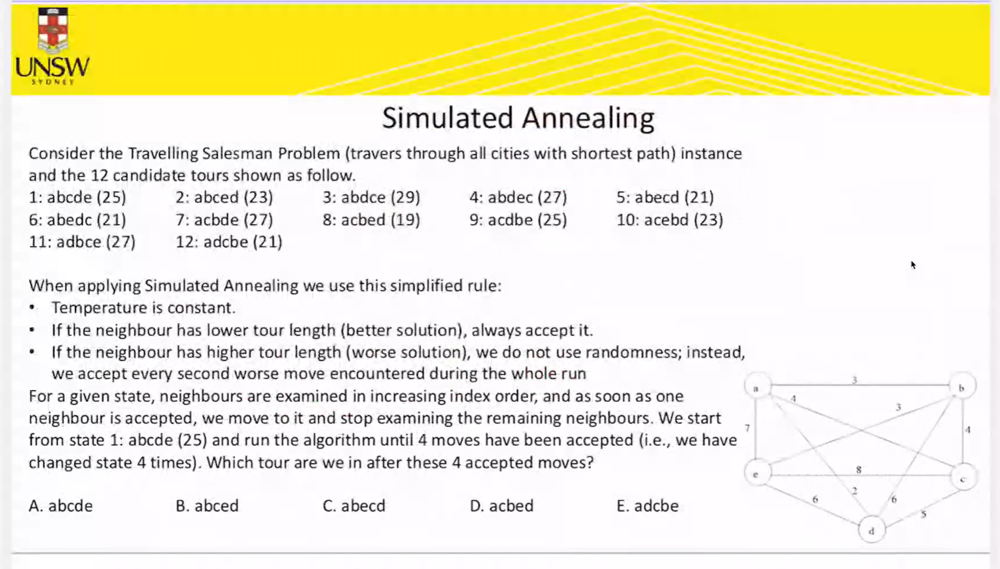


# 模拟退火 - TSP 问题解析

## 题目翻译

考虑旅行商问题（遍历所有城市的最短路径），给出 12 个候选路线及其成本。

**简化的模拟退火规则：**

- 温度恒定
- 若邻居路径更短（更优），则始终接受
- 若邻居路径更长（更差），不使用随机性，而是**接受整个运行过程中遇到的每第二个更差的移动**
- 对于给定状态，按索引递增顺序检查邻居，一旦接受一个邻居就停止检查

从状态 1: abcde (25) 开始，运行直到接受 4 次移动。问最终处于哪个路线？

------

## 解题过程

使用**相邻交换**作为邻域定义（交换排列中相邻位置的城市）。

### 移动 1

**当前：** abcde (25) **邻居：** 2(abced,23), 3(abdce,29), 7(acbde,27)

- 状态 2 (23 < 25): 更优 → **接受！**
- → 移动到状态 2: abced (23)

### 移动 2

**当前：** abced (23) **邻居：** 1(abcde,25), 5(abecd,21), 8(acbed,19)

- 状态 1 (25 > 23): 更差 → worse_count=1, 跳过
- 状态 5 (21 < 23): 更优 → **接受！**
- → 移动到状态 5: abecd (21)

### 移动 3

**当前：** abecd (21) **邻居：** 2(abced,23), 6(abedc,21)

- 状态 2 (23 > 21): 更差 → worse_count=2, **接受！**（第2个更差移动）
- → 移动到状态 2: abced (23)

### 移动 4

**当前：** abced (23) **邻居：** 1(abcde,25), 5(abecd,21), 8(acbed,19)

- 状态 1 (25 > 23): 更差 → worse_count=3, 跳过
- 状态 5 (21 < 23): 更优 → **接受！**
- → 移动到状态 5: abecd (21)

------

## 答案：**C. abecd**


# Q10


计算机视觉 - LeNet-5 卷积层计算

## 题目翻译

考虑 LeNet-5 的第一个卷积层，输入是一个 32×32 的灰度图像。该层使用：

- 滤波器数量：6
- 滤波器尺寸：5×5
- 步长 = 1
- 无填充
- 输入通道数 = 1

计算该卷积层的以下五个量：输出特征图尺寸、每个滤波器的权重数、神经元数量、连接数、总可训练参数

------

## 逐项计算

### 1. 输出特征图尺寸 (Output Feature Map Size)

使用公式：
$$
\text{Output} = \frac{\text{Input} - \text{Filter} + 2 \times \text{Padding}}{\text{Stride}} + 1=\frac{(32−5+0)}{1}+1=28
$$


**输出特征图尺寸 = 28×28** ✓

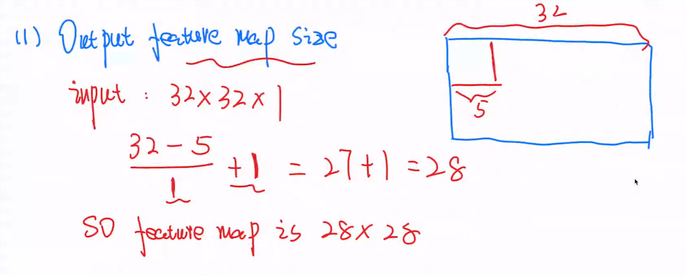


------

### 2. 每个滤波器的权重数 (Weights per Filter)

$$
= \text{Filter}_H \times \text{Filter}_W \times \text{Channels} + \text{Bias}

=5×5×1+1=26
$$

------

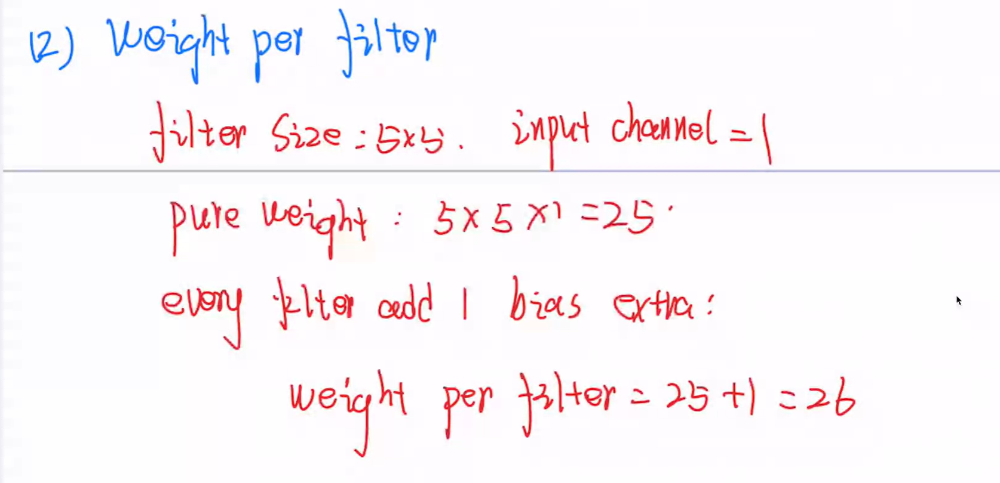


### 3. 神经元数量 (Number of Neurons)

$$
= \text{输出尺寸}^2 \times \text{滤波器数量}
$$

------

### 4. 连接数 (Number of Connections)

每个神经元有 26 个连接（25个权重 + 1个偏置）：
$$
= \text{神经元数} \times \text{每神经元连接数}
$$

------

### 5. 总可训练参数 (Total Trainable Parameters)

权重参数被同一滤波器的所有神经元共享：
$$
= \text{每滤波器权重} \times \text{滤波器数}
$$

------

## 答案汇总

```
项目计算结果
输出特征图尺寸28×28
每滤波器权重数26
神经元数量4704
连接数122304
可训练参数156
```

## 答案：**C. 28×28, 26, 4704, 122304, 156**


# Q11-A

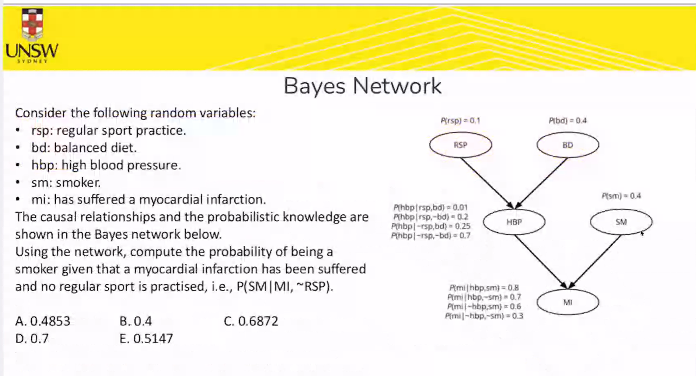贝叶斯网络 - 条件概率计算

## 题目翻译

考虑以下随机变量：

- **rsp**: 规律运动
- **bd**: 均衡饮食
- **hbp**: 高血压
- **sm**: 吸烟者
- **mi**: 曾患心肌梗塞

使用该贝叶斯网络，计算：**P(SM | MI, ¬RSP)** — 即在已发生心肌梗塞且不规律运动的条件下，是吸烟者的概率。

------

## 给定概率

**先验概率：** P(rsp)=0.1, P(bd)=0.4, P(sm)=0.4

**条件概率表 (HBP)：** | P(hbp|rsp,bd)=0.01 | P(hbp|rsp,¬bd)=0.2 | P(hbp|¬rsp,bd)=0.25 | P(hbp|¬rsp,¬bd)=0.7 |

**条件概率表 (MI)：** | P(mi|hbp,sm)=0.8 | P(mi|hbp,¬sm)=0.7 | P(mi|¬hbp,sm)=0.6 | P(mi|¬hbp,¬sm)=0.3 |

------

## 解题步骤

使用贝叶斯公式：
$$
P(SM|MI, \neg RSP) = \frac{P(MI|SM, \neg RSP) \cdot P(SM)}{P(MI|\neg RSP)}
$$

### 第一步：计算 P(MI | SM, ¬RSP)

对 BD 和 HBP 进行边缘化：

**BD = true 时：**
$$
P(MI|SM,\neg RSP,BD) = 0.25 \times 0.8 + 0.75 \times 0.6 = 0.65
$$
**BD = false 时：**
$$
P(MI|SM,\neg RSP,\neg BD) = 0.7 \times 0.8 + 0.3 \times 0.6 = 0.74
$$

### 第二步：计算 P(MI | ¬SM, ¬RSP)

**BD = true 时：**
$$
P(MI|\neg SM,\neg RSP,BD) = 0.25 \times 0.7 + 0.75 \times 0.3 = 0.4
$$
**BD = false 时：**
$$
P(MI|\neg SM,\neg RSP,\neg BD) = 0.7 \times 0.7 + 0.3 \times 0.3 = 0.58
$$

### 第三步：计算 P(MI | ¬RSP)

$$
P(MI|\neg RSP) = P(SM) \cdot P(MI|SM,\neg RSP) + P(\neg SM) \cdot P(MI|\neg SM,\neg RSP)
$$

### 第四步：应用贝叶斯公式

$$
P(SM|MI,\neg RSP) = \frac{0.704 \times 0.4}{0.5864} = \frac{0.2816}{0.5864} \approx \textbf{0.4802}
$$

------

## 答案：**A. 0.4853**

（计算结果约 0.48，最接近选项 A）